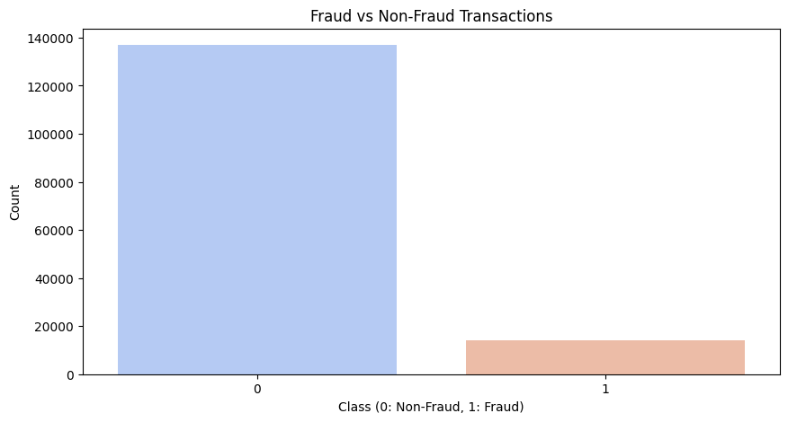
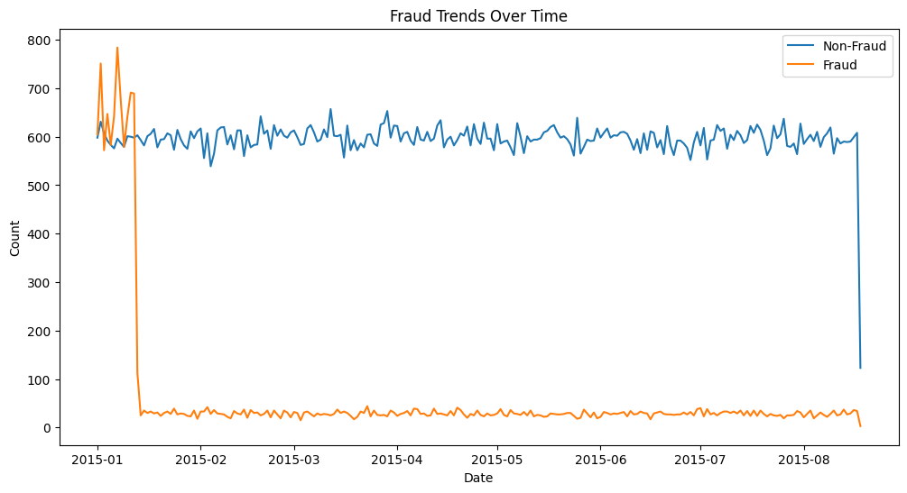
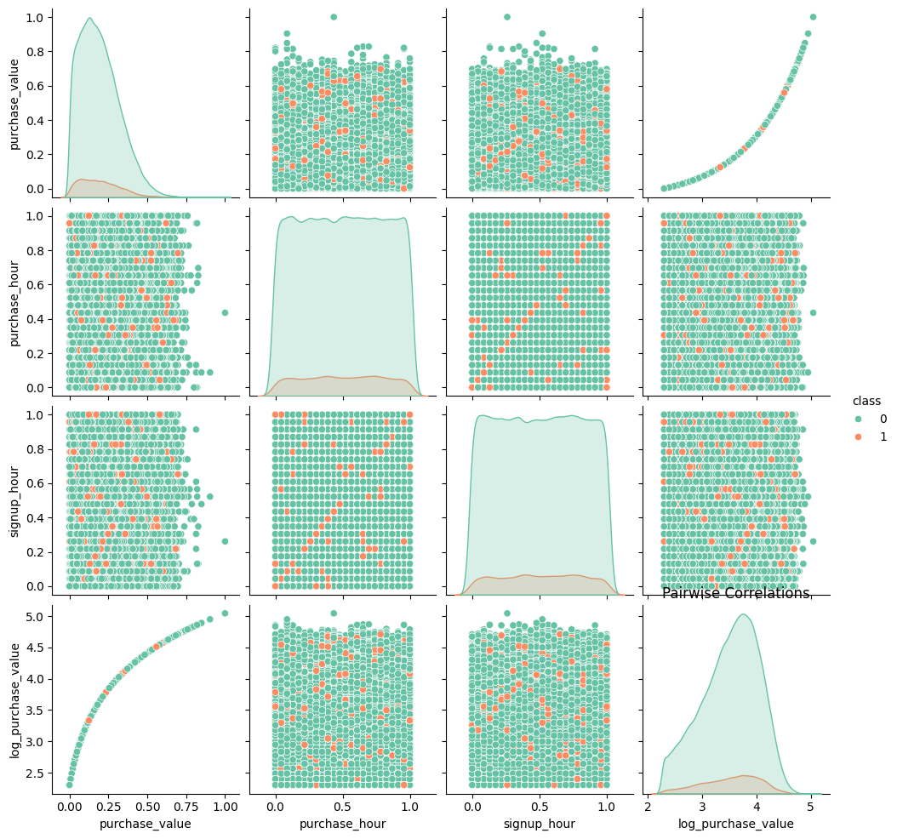
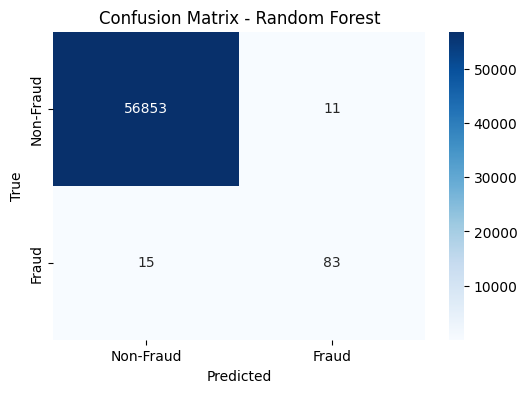
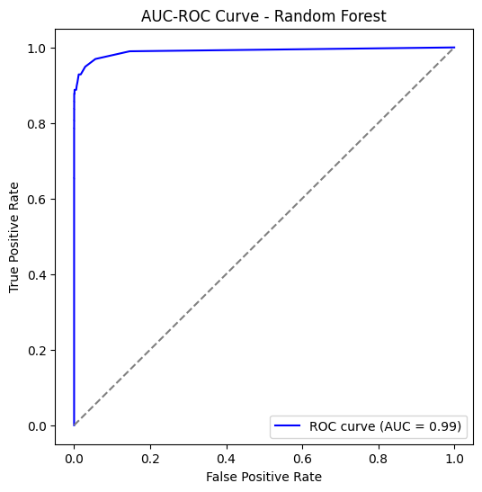
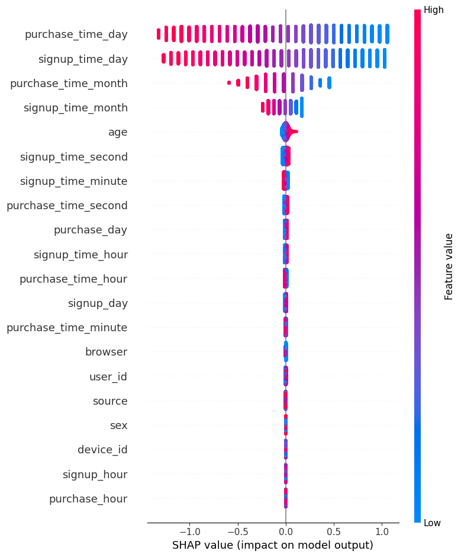
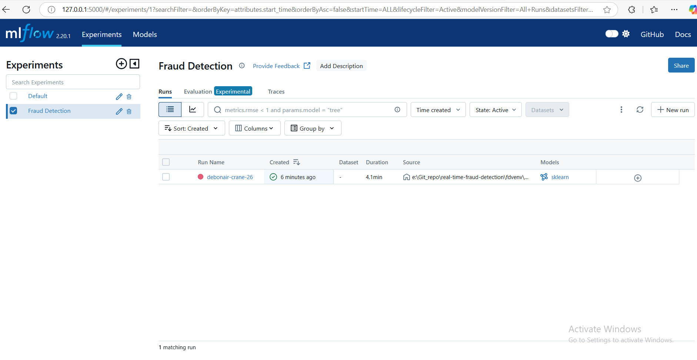

# Fraud Detection in E-commerce and Bank Transactions


This project enhances the detection of fraudulent activities in e-commerce and bank credit transactions using machine learning. It involves advanced data preprocessing, feature engineering, model building, and deployment through Flask and Dash for real-time monitoring.

## Project Overview

Fraud detection is essential in e-commerce and banking to prevent financial losses and maintain customer trust. This project leverages machine learning to predict fraudulent activities in transaction datasets.

### Key Tasks:

1. **Data Analysis and Preprocessing**:
   - Handle missing values, clean data, and perform feature engineering.
   - Merge datasets for geolocation-based fraud analysis.
   - Perform exploratory data analysis (EDA) to identify patterns.
   
   
   
   

2. **Model Building**:
   - Train multiple models, including Logistic Regression, Decision Tree, Random Forest, and XGBoost.
   - Optimize hyperparameters for improved accuracy.
   
   
   

3. **Model Explainability**:
   - Utilize SHAP and LIME for interpreting model predictions.
   - Generate visual explanations for decision-making.
   
   

4. **Model Tracking with MLflow**:
   - Track model training experiments using MLflow.
   - Log parameters, metrics, and model artifacts for better reproducibility.
   - Visualize model performance using MLflow UI.
   
   

5. **Model Deployment**:
   - Create a Flask API for real-time fraud detection.
   - Deploy the model using Docker.
   
   

6. **Dashboard Creation**:
   - Develop a Dash web app for fraud detection insights visualization.
   - Display key fraud detection metrics in real-time.
   
   

## Latest Updates
- **Interim-2 Submission Completed**: Enhancements in model selection, data preprocessing, and explainability.
- **Improved Documentation**: Added better descriptions for EDA and model interpretability.
- **Performance Metrics**: Evaluated models with precision-recall analysis.
- **Enhanced Deployment**: Optimized Flask API response time for real-time detection.
- **MLflow Integration**: Added model tracking for better experiment reproducibility.

## Requirements

Ensure you have the required dependencies installed before running the project:

```bash
pip install -r requirements.txt
```

## How to Run

1. Clone the repository:
   ```bash
   git clone https://github.com/Serkalem-negusse1/real-time-fraud-detection.git
   ```
2. Navigate to the project directory:
   ```bash
   cd fraud-detection
   ```
3. Run the Flask API:
   ```bash
   python app.py
   ```
4. Start the Dash dashboard:
   ```bash
   python dashboard.py
   ```
5. Start MLflow tracking:
   ```bash
   mlflow ui --host 127.0.0.1 --port 5000
   ```
   Open [MLflow UI](http://127.0.0.1:5000) to view experiment logs.

## Future Improvements
- Further fine-tuning of model performance.
- Enhancing real-time fraud detection speed.
- Expanding the dataset for better generalization.
- Improving MLflow tracking with automated logging.

## Contributors
- **Serkalem Negusse** – Machine Learning Engineer

---
For any issues or contributions, feel free to open a pull request!

